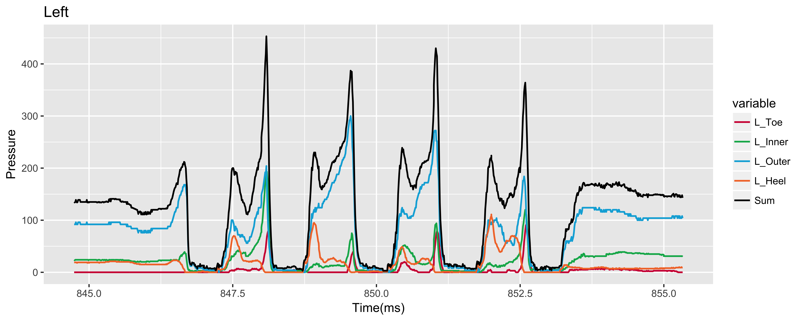
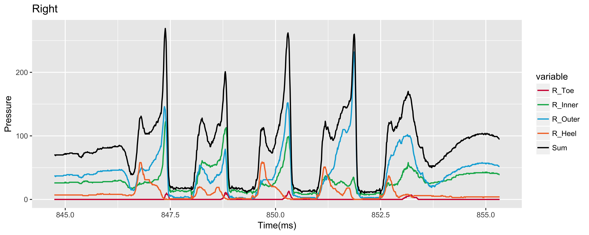

# Period conclusion for innovation experiment

### 2018.4.2

### Yuxing Hu, Tiankai Jiang and Sitong Liu.

---

## **Rewind**
In the past two weeks, we've done several work on pace evaluate the dataset of different position of human activities and the paper we received from Yimian company. Because of the lack of ability, we spent a long time on studing and discussing the paper *A foot-wearable interface for locomotion mode recognition based on discrete contact force distribution*. Another huge time consuming work is learning the R language, which made us possible to plot the chart via time and pressure. No need to mention that we also preprocessing the data to filter them and only reserve timestamp and four vital pressure data from four different position of one foot.

---

## **Paper Review**

1. Although four sensors on an insole carry different information, to delimit the variables and make it easy analyze, four signals were summed together. The sum also passes on rich information.
2. Through the signals, we can see that they are quasi-peroidic and show different characteristics in different phases.
3. The signal of different gaits cannot be analyzed directly. Instead, they should be divided into four 0.2s analysis window in terms of foot contact and  foot off.
4. The feature vector was consisted of three types of feature values. Namely,  third-order autoregression coefficients, correlation coefficients of any two force channels of each insole and the sum of variance ranges of all eight channels of signals within the analysis window.
5. Sitting and standing are treated differently from other 3 gaits because both vary little with time.

---

## **Data Pre-processing**

To avoid unneeded information affecting and make the data exectuable, we use Python to build a tool on transfering from log file into csv file so that the data is able to use.

---

## **Data Plotting**

The Y-axis of the picture is the pressure value of toe, inner, outer heel and sum of them. And also we seperate the left foot and right foot to be more accurate and easy to further analyse. 

We plotted all different positions and here we take upstair movement as an example.

* Upstairs: Left foot

* Upstairs: Right foot

---

## **Future work**

In the following one or two weeks, we will concentrate on learning time serial analysis and try to build a simple classification model to evaluate the the attribute of the model.
